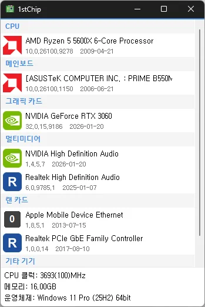

# 1stChip

**一眼看清电脑配置与驱动。**

[English](README.md) · [한국어](README.ko.md) · 简体中文 · [日本語](README.ja.md) · [Español](README.es.md) · [Português (Brasil)](README.pt-BR.md) · [Français](README.fr.md)

> 本文档为译文。如有出入，以[韩文版](README.ko.md)为准。

## 简介

1stChip 在一个界面上显示电脑内部的硬件——CPU、主板、显卡、多媒体、网卡及其他设备——并同时列出每个设备已安装驱动的版本和日期。

即使在刚装好的 Windows 上也能使用：尚未安装驱动、在设备管理器中只显示为"未知设备"的硬件，也会连同制造商一起出现在列表中。重装系统后想知道还缺哪些驱动时，这一点特别方便。

解压即用。无需安装，无需管理员权限，也不需要安装任何其他组件。

## 主要功能

- **单屏硬件摘要** — CPU、主板、显卡、多媒体、网卡、其他设备，均带有制造商标志。
- **已安装驱动的版本和日期**，显示在设备名称下方。
- **无驱动也能识别** — 未安装驱动的设备同样会连同制造商一起列出，并标记 `!`。
- **驱动更新检查** — 将列表与 1stChip 服务器比对；若已知有更新的驱动，会标记该设备，鼠标悬停可查看可用版本。
- **一键打开驱动页面** — 点击 `!` 标记即可打开该设备的驱动页面。
- **系统信息栏** — 底部显示 CPU 频率、内存总量以及 Windows 版本。
- **合并重复设备** — 相同设备只显示一次，以 `(×N)` 表示数量。
- **便携** — 只有一个 EXE 文件，可以放在 U 盘里随身携带。
- **无需管理员权限。**
- **跟随 Windows 设置** — 深色/浅色模式跟随 Windows 应用主题；界面语言跟随 Windows 显示语言（英语、韩语）。

## 下载 / 安装

| 类型 | 链接 |
|---|---|
| 安装版 | [下载](https://down.kilho.net/1stchip?lang=zh) |
| 便携版 (ZIP) | [下载](https://down.kilho.net/1stchip?lang=zh&nosetup) |

1stChip 可作为**便携**应用使用：下载 ZIP，解压到任意位置，运行 `1stChip.exe` 即可，无需安装。从 U 盘直接运行也没有问题。

## 使用方法

### 基本流程

1. 运行 `1stChip.exe`，几秒内硬件列表就会显示。
2. 列表按 **CPU → 主板 → 显卡 → 多媒体 → 网卡 → 其他设备** 分组。每个类别的第一行是代表设备，其余以灰色列出。
3. 设备名称下方显示**已安装驱动的版本和日期**。
4. 黄色 `!` 表示需要留意。悬停可查看原因，**点击**则在浏览器中打开该设备的驱动页面。
5. 窗口底部显示 CPU 频率、内存大小和 Windows 版本。

列表在启动时读取一次。安装驱动后，请关闭并重新运行 1stChip 查看结果。

### 窗口布局

| 部分 | 显示内容 |
|---|---|
| 标志 | 制造商标志（没有标志的厂商显示首字母） |
| 设备名称 | Windows 指定的名称。相同设备合并为 `(×2)` |
| 第二行 | 已安装驱动的版本 · 日期 |
| `!` | 无驱动 / 有问题 / 已知有更新驱动——悬停可区分，点击打开驱动页面 |
| 底部面板 | CPU 频率（基础频率）· 内存大小 · 操作系统 |

### 常见场景

**刚装好 Windows，不知道该装哪些驱动**
运行 1stChip，找到带 `!` 的设备。悬停时显示"未安装驱动"，说明该设备缺少驱动。点击 `!` 打开驱动页面并安装，然后重新运行 1stChip 确认 `!` 已消失。如果因为缺少网卡驱动而无法上网，可用 1stChip 查看网卡的厂商和型号，再到另一台电脑下载驱动。

**设备管理器里有"未知设备"**
设备管理器在没有驱动时无法显示名称，而 1stChip 无需驱动也能识别制造商和类别。在对应类别中找到该设备并点击 `!` 即可。

**想确认驱动是否为最新**
若已知有更新的驱动，设备会带 `!`，悬停显示"可更新到 x.x.x 版本"。没有 `!` 表示在已知范围内是最新的。

**快速查看电脑配置**
只读每个类别的第一行（代表设备），就能一眼看到 CPU、主板芯片组、显卡、声卡和网卡，底部面板还有内存大小和 Windows 版本。写二手出售信息或对照游戏推荐配置时很方便。

**有多个相同设备**
相同设备合并为一行，并显示 `(×2)` 之类的数量。USB 集线器、内部桥接等用户无需关心的结构性设备不会出现在列表中。

**检查多台电脑**
1stChip 无需安装，也不需要管理员权限，放在 U 盘里逐台运行即可，不会在电脑上留下任何痕迹。

**在无法上网的电脑上**
硬件列表和已安装驱动信息在离线状态下完全可用。只有"有更新驱动"标记和点击 `!` 打开的驱动页面需要网络。

**窗口是深色（或浅色），或显示英文**
1stChip 跟随 Windows 设置。深色/浅色在 Windows *设置 → 个性化 → 颜色 → 应用模式* 中更改，界面语言随 Windows 显示语言（韩语 → 韩语，其他 → 英语）。

程序同时只运行一个实例；再次启动时会把已打开的窗口置于前台。

## 设置

没有设置窗口。1stChip 会自动跟随 Windows 设置：

| 项目 | 依据 |
|---|---|
| 浅色 / 深色模式 | Windows *设置 → 个性化 → 颜色 → 应用模式* |
| 界面语言 | Windows 显示语言（韩语 → 韩语，其他 → 英语） |
| 日期格式 | 按语言本地化（韩语 `yyyy-mm-dd`，英语 `mm-dd-yyyy`） |

## 系统要求

- Windows 10 或 Windows 11，**64 位**
- 无需管理员权限
- 网络连接可选——仅用于驱动更新检查

## 更新

1stChip **不会**自动更新。新版本经内部验证后手动发布，并在 [1stChip 页面](https://v2.kilho.net/1stchip)公告。请参阅[更新政策说明](https://en.kilho.net/archives/notice/2940)。

**版本历史**

| 版本 | 日期 | 说明 |
|---|---|---|
| 0.9.0 | 2026-09-18 | 首次发布 |

## 许可

1stChip 是**免费软件（Freeware）**。

您可以在任何地方使用——家庭、办公室、学校、政府机关——并可以未经修改的形式自由再分发。

## 链接

- 网站：<https://v2.kilho.net/1stchip>
- 论坛：<https://groups.google.com/g/kilhonet>
- X (Twitter)：<https://www.twitter.com/kilhonet>

© KILHO.NET
